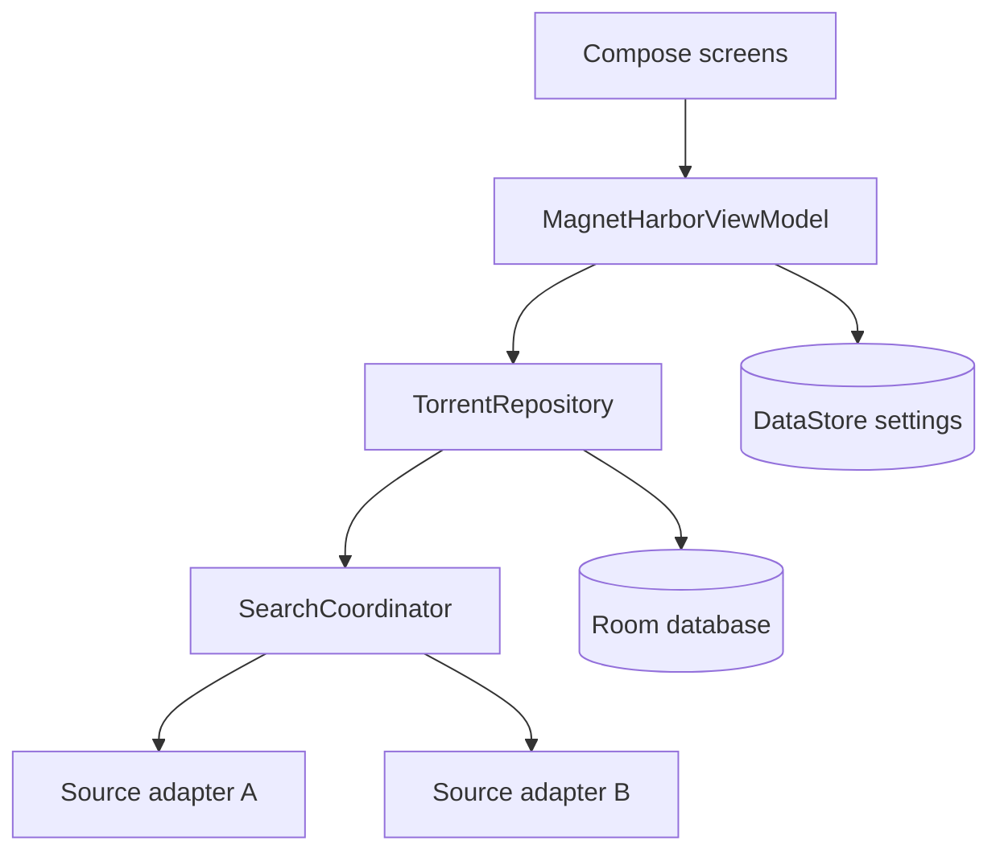

# Architecture

## Data flow

`SearchCoordinator` launches enabled providers under a supervisor scope. A provider failure becomes a visible per-source error and does not cancel successful searches. Results are deduplicated using the BitTorrent info-hash, with normalized title and size as a fallback.

## Package responsibilities

| Package | Responsibility |
| --- | --- |
| `data.model` | Provider-independent result, category, and sorting models |
| `data.source` | Source contract, fan-out coordination, error isolation, deduplication |
| `data.local` | Room entities and DAOs for favorites and history |
| `data.settings` | DataStore-backed preferences |
| `data.repository` | Search and persistence use cases |
| `ui` | Compose screens and presentation state |

## Source adapter rules

1. Return only normalized `TorrentResult` values.
2. Apply a network timeout and allow coroutine cancellation.
3. Never log full magnet links, credentials, or user search history.
4. Treat remote fields as untrusted input.
5. Add parser fixtures and unit tests for every live provider.
6. Respect the provider's published API conditions and local law.

## Future modularization

The MVP is intentionally a single Android module. Once several live providers exist, move the source contract to `core:model`, provider adapters to separate modules, and UI features to `feature:*` modules. This keeps early iteration quick without locking the project into a monolith.
